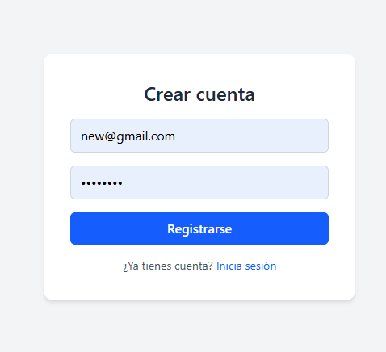
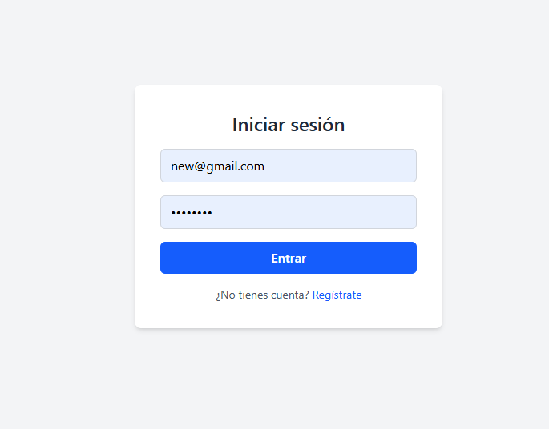
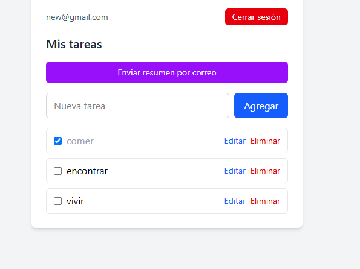
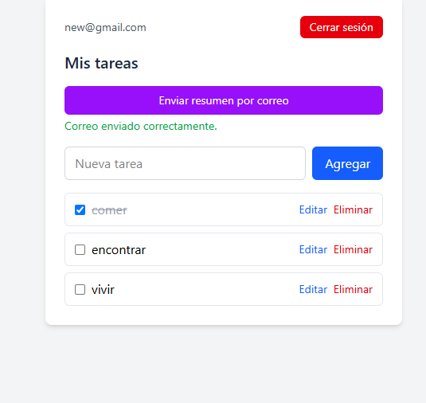
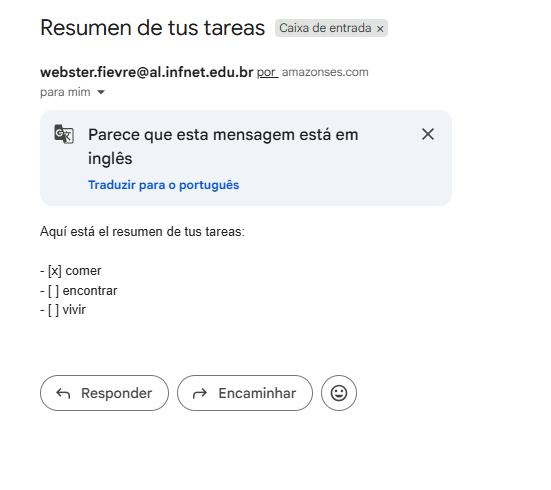

# Strategic Task Manager

A web application for managing personal tasks with user authentication, real-time persistence, and email notifications. Each user can only view and modify their own tasks.

**Production demo:** https://proyecto-m4-webster-fievre-3i38.vercel.app/
**Repository:** https://github.com/WebsterFever/ProyectoM4_WebsterFievre

---

## Application Screenshots

| Registration | Login |
|---|---|
|  |  |

| Task Dashboard | Summary Sent by Email |
|---|---|
|  |  |

| Received Email |
|---|
|  |

> The images in this section should be stored in `docs/screenshots/` using the filenames shown above (`register.png`, `login.png`, `dashboard.png`, `dashboard-email-sent.png`, `email-received.png`).

---

## Project Description

The Strategic Task Manager allows a user to register, sign in, and manage a personal task list (create, complete, edit, and delete) synchronized in real time. The user can also request an email summary of their tasks, securely processed through a custom serverless function.

## Technologies Used

- **React 19 + TypeScript** — user interface
- **Vite** — build tool and development server
- **Tailwind CSS v4** — styling
- **React Router v7** — client-side routing and navigation
- **Firebase Authentication** — user registration, login, and session management
- **Cloud Firestore** — task database with Security Rules
- **Vercel** — hosting and serverless functions
- **AWS SES** (vía Vercel Function) — email delivery
- **Vitest + React Testing Library** — testing

## Architecture

```text
project-root/
├── src/
│   ├── pages/          # Full pages (Register, Login, Dashboard)
│   ├── components/      # Reusable components (ProtectedRoute)
│   ├── context/          # AuthContext (global session state)
│   ├── services/         # Data logic: Firebase, Firestore, email
│   ├── types/             # TypeScript interfaces (Task)
│   └── test/               # Test configuration
├── api/
│   └── send-email.ts    # Serverless function (Vercel), calls AWS SES
├── firestore.rules        # Firestore security rules
├── vercel.json             # SPA route configuration in Vercel
├── .env / .env.example
└── README.md
```

### Data Flow

**Authentication and tasks:**
```text
User → React → Firebase Authentication → Firestore
                                              (protected by Security Rules
                                               based on the user's UID)
```

**Email delivery:**
```text
User → React → Vercel Function (/api/send-email) → AWS SES → Email
```

React **never** calls AWS SES directly. AWS credentials (`AWS_ACCESS_KEY_ID`, `AWS_SECRET_ACCESS_KEY`) exist only as server-side environment variables in the serverless function and are never sent to the browser. This prevents users from extracting them by inspecting client-side code.

## Installation

```bash
git clone https://github.com/WebsterFever/ProyectoM4_WebsterFievre.git
cd ProyectoM4_WebsterFievre
npm install
```

## Environment Variables

Copy `.env.example` to `.env` and fill in the real values:

```env
# Firebase (public, exposed to the browser — protected by Security Rules, not by hiding them)
VITE_FIREBASE_API_KEY=
VITE_FIREBASE_AUTH_DOMAIN=
VITE_FIREBASE_PROJECT_ID=
VITE_FIREBASE_STORAGE_BUCKET=
VITE_FIREBASE_MESSAGING_SENDER_ID=
VITE_FIREBASE_APP_ID=

# AWS SES (private — used only by the serverless function, never by the frontend)
AWS_ACCESS_KEY_ID=
AWS_SECRET_ACCESS_KEY=
AWS_REGION=
SES_FROM_EMAIL=
```

Variables with the `VITE_` prefix are included by Vite in the browser bundle; the others exist only in the serverless function runtime.

To run the project locally, including the serverless function:

```bash
npm run dev        # frontend only (Vite)
vercel dev          # frontend + serverless function (/api/send-email)
```

## Firebase

The project uses two Firebase products:

- **Authentication**, with the **email/password** provider (no social login or MFA, which are outside the scope of the project).
- **Cloud Firestore**, as the task database.

### Authentication Flow

1. `registerUser` / `loginUser` (`src/services/authService.ts`) call the Firebase Auth SDK.
2. `AuthContext` (`src/context/AuthContext.tsx`) subscribes to `onAuthStateChanged`, maintaining a global state `{ currentUser, loading }`, accessible from any component through the `useAuth()`.
3. `ProtectedRoute` (`src/components/ProtectedRoute.tsx`) uses that state to redirect to `/login` when there is no active session, while showing a loading state until Firebase confirms the session (preventing users with slow connections from being redirected incorrectly).

## Firestore — Data Model and Security Rules

### `Task` Model

```ts
interface Task {
  id: string;
  userId: string;
  title: string;
  completed: boolean;
  createdAt: number;
  updatedAt: number;
}
```

### Security Rules (`firestore.rules`)

```text
match /tasks/{taskId} {
  allow read, update, delete: if request.auth != null
                                && request.auth.uid == resource.data.userId;
  allow create: if request.auth != null
                 && request.auth.uid == request.resource.data.userId;
}
```

These rules ensure that a user can **never** read, edit, or delete another user's tasks, regardless of what the frontend does. They were manually verified with Firebase's Rules Playground by simulating cross-user reads between two different users (see the "Use of AI" section below).

## Task Flow (CRUD)

All data logic lives in `src/services/taskService.ts`, separated from the UI (`src/pages/DashboardPage.tsx`):

1. **List** — real-time synchronization with `onSnapshot` (no `getDocs`): any change in Firestore is automatically reflected in the UI without refreshing. The subscription is cancelled in the `useEffect` cleanup to prevent memory leaks.
2. **Create** — `createTask`, vía `addDoc`.
3. **Complete** — `toggleTaskCompleted`, vía `updateDoc`.
4. **Edit** — `updateTaskTitle`, inline editing in the list.
5. **Delete** — `deleteTask`, vía `deleteDoc`, with confirmation (`window.confirm`).

## AWS SES Flow

```text
React (DashboardPage) → sendEmail() → fetch("/api/send-email")
   → api/send-email.ts (Vercel Function) → AWS SES → Email
```

- The frontend only knows its own endpoint `/api/send-email`, never AWS directly.
- The serverless function validates the HTTP method and required fields, uses the SDK `@aws-sdk/client-ses` with server-side environment credentials, and returns `200`/`400`/`500` depending on the result.
- The UI explicitly handles the states `idle | sending | success | error`.

**Known limitation (documented decision):** the AWS SES account is in **sandbox mode**, which only allows sending emails to verified addresses. For demonstration purposes, the task summary is always sent to a fixed verified address (`webster.fievre@al.infnet.edu.br`), regardless of the signed-in user. In a real production environment, AWS "production access" would be requested to remove this restriction.

## Testing

```bash
npm test
```

Tests use **Vitest** + **React Testing Library**, for `RegisterPage` y `LoginPage`:

- Correct rendering of the forms.
- Controlled inputs update correctly when typing (user interaction simulated with `@testing-library/user-event`).
- Success flow: navigation to the next route after successful registration/login.
- Error flow: visible error message when Firebase rejects the operation.

Firebase (`authService`) is **mocked** with `vi.mock`, so tests do not depend on the network or create real users — the component behavior is tested, not Firebase itself.

## Deploy

Deployed on **Vercel**, with automatic deployment on every `git push` to `main`.

- **Environment variables**: configured in the Vercel dashboard (Settings → Environment Variables) for the production environment — never committed through Git.
- **SPA routes**: `vercel.json` includes a rewrite rule that sends any route other than `/api/*` to `index.html`, allowing React Router to correctly handle routes such as `/dashboard` on refresh or direct URL access.

## Technical Decisions

- **Folder architecture**: `services/` separates data logic (Firebase, Firestore, email) de la UI (`pages/`, `components/`), making testing and maintenance easier.
- **Context API** (`AuthContext`) instead of prop drilling: the user session is needed across multiple components that are not directly related in the component hierarchy (`ProtectedRoute`, `DashboardPage`); centralizing it avoids multiple duplicate subscriptions a `onAuthStateChanged`.
- **`onSnapshot` en vez de `getDocs`** for listing tasks: real-time synchronization without manual refreshes after each operation.
- **Minimal `Task` model** (6 campos): fields such as `priority` or `dueDate` were kept outside the mandatory scope and reserved for possible future enhancements.
- **AWS IAM with minimum permissions**: el usuario `gestor-tareas-ses-sender` only has the `AmazonSESFullAccess`, policy, not full administrative access to the AWS account (principle of least privilege).
- **Fixed email in sandbox mode**: see the "AWS SES Flow" section.

## Use of Artificial Intelligence

This project was developed with the assistance of an AI assistant (Claude) in a step-by-step mentoring workflow: the assistant explained concepts and proposed code, and each change was implemented, tested, and manually verified before moving forward. Below is a record of the most relevant prompts and decisions (trivial steps are omitted):

---

**Prompt used:** Step-by-step guidance to initialize a React + TypeScript project with Vite, configure Git, and review `.gitignore` before the first commit.

**What I learned:** The difference between a remote repository (GitHub) and a local repository (`git init`); `git init/add/commit` are local operations, while only `git push` requires network access; Vite's default `.gitignore` does not protect `.env` files.

**Decision I made:** Add `.env` and `.env.local` to `.gitignore` from the first milestone, before any real `.env` file existed, to avoid accidentally committing credentials later.

---

**Prompt used:** Guidance for enabling Firebase Authentication with the email/password provider, plus an explanation of the Observer pattern behind `onAuthStateChanged`.

**What I learned:** Firebase Authentication requiere activar explícitamente cada proveedor de login; el token de sesión se persiste en el navegador, por eso la sesión forvive a un refresh.

**Decision I made:** Use only the "Email/password" provider, without social login or MFA, to keep the project scope aligned with the defined requirements.

---

**Prompt used:** Design Firestore Security Rules so a user cannot read or modify another user's tasks, and verify them before building the CRUD.

**What I learned:** The difference between `resource.data` (existing data) and `request.resource.data` (data being written) in Firestore rules; how to use the Rules Playground to simulate requests with different UIDs without needing application code.

**Decision I made:** Explicitly verify, with two cross-user simulations (User A reading User B's data, and the owner reading their own), that data isolation worked before moving on to the CRUD — development did not proceed until both cases were confirmed.

---

**Prompt used:** Explain why React should not call AWS SES directly, and design the React → Vercel Function → AWS SES architecture.

**What I learned:** The difference between public environment variables (`VITE_...`, included in the browser bundle) and private ones (without a prefix, only available to serverless functions); and the principle of least privilege applied to AWS credentials (IAM permissions limited to SES instead of full account access).

**Decision I made:** Restrict the AWS IAM user to the `AmazonSESFullAccess` policy only, and keep email delivery limited to a verified address while the SES account remains in sandbox mode, documenting the limitation instead of trying to remove it outside the project scope.

---

**Prompt used:** Migrate task loading from `getDocs` (one-time query) to `onSnapshot` (real-time synchronization), and explain the risk of memory leaks if the subscription is not cancelled.

**What I learned:** The difference between requesting data once and subscribing to continuous changes; why the `useEffect` cleanup function is required to cancel active subscriptions when a component unmounts or its dependencies change.

**Decision I made:** Remove all manual "refresh data" calls after creating/editing/deleting tasks, allowing `onSnapshot` to update the UI automatically — reducing duplicate code and the chance of the UI becoming out of sync with Firestore.

---

**Prompt used:** Configure tests with Vitest + React Testing Library, including mocked Firebase calls with `vi.mock`.

**What I learned:** Why tests should not call real external services (slowness, network dependency, and non-deterministic side effects such as creating real users); how `vi.mock` replaces an entire module during a test; and the difference between `mockResolvedValue` (success) and `mockRejectedValueOnce` (error for a single case).

**Decision I made:** Write at least one error-case test for each tested component (not only the happy path), verifying that error messages are displayed correctly when Firebase rejects an operation.

